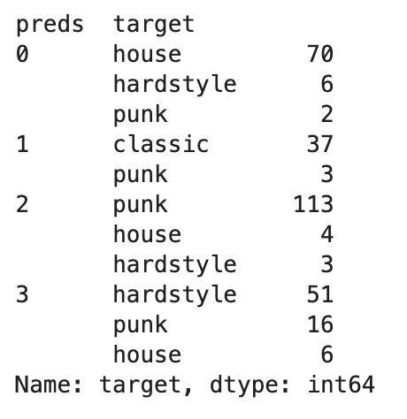
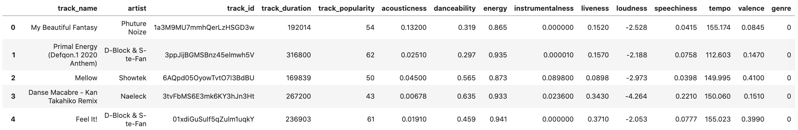
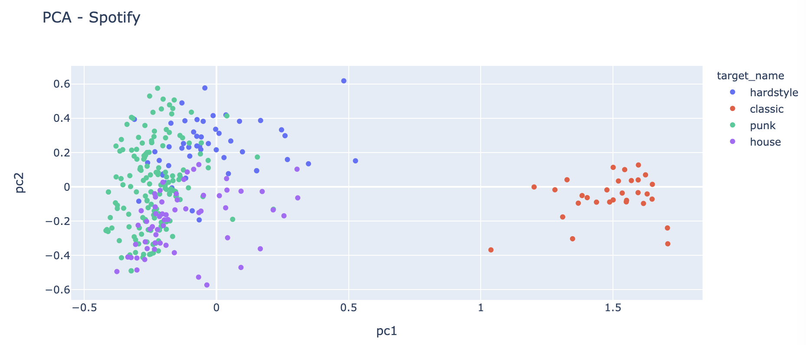

# Overview

<!-- TOC -->

- [Overview](#overview)
- [Scope](#scope)
- [Feature Extraction](#feature-extraction)
- [Analyze different songs](#analyze-different-songs)
    - [Resulting DataFrame of the feature extraction](#resulting-dataframe-of-the-feature-extraction)
    - [Preprocessing for Machine Learning approaches](#preprocessing-for-machine-learning-approaches)
    - [Machine Learning approaches](#machine-learning-approaches)
        - [k-means clustering](#k-means-clustering)
        - [SVM](#svm)
    - [Conclusion](#conclusion)
- [Compare results to the Spotify-API](#compare-results-to-the-spotify-api)
    - [Extract Data](#extract-data)
    - [Compare the results by applying the same ML methods](#compare-the-results-by-applying-the-same-ml-methods)
    - [Result](#result)

<!-- /TOC -->

# Scope

The overall task of this project was to determine the musical genre of a song by means of self-created audio features. In order not to go beyond the scope of this project I concentrated on 4 genres and created a data set of 311 songs.

1. 4 genres: punk, classic, hardstyle & house
2. Librosa library to calculate 27 characteristics of each song
3. Train machine learning models for classification (clustering, Support Vector Machines & RandomForest)
4. Evaluation of the results
5. Comparison to prediction using the features provided by the Spotify API.

To accomplish this task, 27 properties per song were extracted from your record of 311 songs. These were then prepared for a corresponding prediction model using various machine learning techniques such as PCA.

>This project includes both signal processing methods and various machine learning techniques such as clustering & support vector machines. Due to the size of the project, not every method used can be explained in detail. I am also in no way a specialist in signal processing methods, so the results obtained here should only be considered as a first suggestion and certainly provide room for optimization!  
Furthermore, various publications form the basis of this work and offer further information on the respective topics.
* https://myhometheater.homestead.com/RMS.html
* http://mir.ilsp.gr/harmonic_percussive_separation.html
* https://medium.com/heuristics/audio-signal-feature-extraction-and-clustering-935319d2225
* https://towardsdatascience.com/extract-features-of-music-75a3f9bc265d
* https://towardsdatascience.com/feature-selection-with-pandas-e3690ad8504b 
* https://towardsdatascience.com/pca-using-python-scikit-learn-e653f8989e60

# Feature Extraction

# Analyze different songs

For analyzing these songs and therefore be able to create corresponding features which describe the given sound we will use different *feature extraction* tools which are build into `librosa`. Here is an overview over what we will use and what they describe:

* **Harmonic / Percussive Split of the original audio data:**  
The aim of the Harmonic/Percussive separation is to decompose the original music signal to the harmonic (i.e. pitched instruments) and the percussive (non pitched instruments, percussion) parts of the signal. Such methods can be applied to audio mixing software, or can be adopted as preprocessing on other Music Information Retrieval Methods such as rhythm analysis or chord/tonality recognition.
The method is based on the assumption that harmonic components exhibit horizontal lines on the spectrogram while the percussive sounds are evident as vertical lines. By adopting Non-Linear image filters applied to the spectrogram in order to filter out these component, the proposed method is simple, intuitive and does not make any prior assumption of the genre,style or instrumentation of the target music.  
  

Source: http://mir.ilsp.gr/harmonic_percussive_separation.html

```python
# split song into harmonic and percussive parts
y_harmonic, y_percussive = lb.effects.hpss(song)
print('Harmonic / Percussive split successful.')

# Compute power spectrogram.
stft_harmonic = lb.core.stft(y_harmonic, n_fft=n_fft, hop_length=hop_length)
# Compute power spectrogram.
stft_percussive = lb.core.stft(y_percussive, n_fft=n_fft, hop_length=hop_length)
```

* **RMS values and related features:**  
The RMS (Root-Mean-Square) value is the effective value of the total waveform.  It is really the area under the curve. In audio it is the continuous or music power that the amplifier can deliver.   
Using RMS values allows for calculations to be completed more easily.  
Bottom Line: For audio applications, our ears are RMS instruments, not peak reading.  So using RMS values makes sense, and is normally how amplifiers are rated.

```python
rmsH = np.sqrt(np.mean(np.abs(lb.feature.rms(S=stft_harmonic)) ** 2, axis=0, keepdims=True))
rmsH_a = np.mean(rmsH)
rmsH_std = np.std(rmsH)
rmsH_skew = skew(np.mean(rmsH, axis=0))
rmsH_kurtosis = kurtosis(np.mean(rmsH, axis=0), fisher=True, bias=True)

rmsP = np.sqrt(np.mean(np.abs(lb.feature.rms(S=stft_percussive)) ** 2, axis=0, keepdims=True))
rmsP_a = np.mean(rmsP)
rmsP_std = np.std(rmsP)
rmsP_skew = skew(np.mean(rmsP, axis=0))
rmsP_kurtosis = kurtosis(np.mean(rmsP, axis=0), fisher=True, bias=True)
```

*   **Spectral Centroid:**
It indicates where the ”centre of mass” for a sound is located and is calculated as the weighted mean of the frequencies present in the sound. If the frequencies in music are same throughout then spectral centroid would be around a centre and if there are high frequencies at the end of sound then the centroid would be towards its end.

```python
centroid = lb.feature.spectral_centroid(song, sr, n_fft=n_fft, hop_length=hop_length)  
centroid_a = np.mean(centroid)
centroid_std = np.std(centroid)
```

*  **Chroma Frequencies:**
Chroma features are an interesting and powerful representation for music audio in which the entire spectrum is projected onto 12 bins representing the 12 distinct semitones (or chroma) of the musical octave. It is a representation of how humans relate colors to notes. In other words we think of same notes but from two different octaves to be of the same color. Thus we have 12 possible values at each window. A, A#, B, C, C#, D, D#, E, F, F#, G and G#. Of course they are not mutually exclusive hence for a given time fame one can have more than one note. But to keep things simple we will only select the most prominent note for a particular window. Let us visualize the chroma vector using a chromagram.

```python
def getNoteFrequency( chromagram ):
    
    # Total number of time frames in the current sample
    numberOfWindows = chromagram.shape[1]
    
    # Taking the note with the highest amplitude
    freqVal = chromagram.argmax( axis = 0 )
    
    # Converting the freqVal vs time to freq count
    histogram, bin = np.histogram( freqVal, bins = 12 ) 
    
    # Normalizing the distribution by the number of time frames
    normalized_hist = histogram.reshape( 1, 12 ).astype( float ) / numberOfWindows
    
    return normalized_hist

chroma = lb.feature.chroma_stft(song, sr=sr)
noteFrequency = getNoteFrequency(chroma)
```

* **Spectral bandwidth:**  
Computes the order- p  spectral bandwidth:  
$$( \sum \limits_{n=0}^{\infty} S ( k ) * (  f ( k ) - f_{c} )^p)^{\frac{1}{p}} )$$  

where  S(k)  is the spectral magnitude at frequency bin  k ,  f(k)  is the frequency at bin  k , and  fc  is the spectral centroid. When  p=2 , this is like a weighted standard deviation.

```python
bw = lb.feature.spectral_bandwidth(song, sr, n_fft=n_fft, hop_length=hop_length)  
bw_a = np.mean(bw)
bw_std = np.std(bw)
```

* **Spectral contrast:**  
Spectral contrast considers the spectral peak, the spectral valley, and their difference in each frequency subband.  
Automatic music type classification is very helpful for the management of digital music database. Octavebased Spectral Contrast feature is proposed to represent the spectral characteristics of a music clip. It represented the relative
spectral distribution instead of average spectral envelope. Experiments showed that Octave-based Spectral Contrast feature
performed well in music type classification. Another comparison experiment demonstrated that Octave-based Spectral Contrast
feature has a better discrimination among different music types than Mel-Frequency Cepstral Coefficients (MFCC), which is
often used in previous music type classification system.  
Each frame of a spectrogram S is divided into sub-bands. For each sub-band, the energy contrast is estimated by comparing the mean energy in the top quantile (peak energy) to that of the bottom quantile (valley energy). High contrast values generally correspond to clear, narrow-band signals, while low contrast values correspond to broad-band noise.

```python
contrast = lb.feature.spectral_contrast(song, sr, n_fft=n_fft, hop_length=hop_length)
contrast_a = np.mean(contrast)
contrast_std = np.std(contrast)
```

* **Polynomial features:**  
Get coefficients of fitting an nth-order polynomial to the columns of a spectrogram.

```python
polyfeat = lb.feature.poly_features(y_harmonic, sr, n_fft=n_fft, hop_length=hop_length)
polyfeat_a = np.mean(polyfeat[0])
polyfeat_std = np.std(polyfeat[0])
```

* **Tonal centroid features (tonnetz):**  
In musical tuning and harmony, the Tonnetz (German: tone-network) is a conceptual lattice diagram representing tonal space first described by Leonhard Euler in 1739. Various visual representations of the Tonnetz can be used to show traditional harmonic relationships in European classical music.

```python
tonnetz = lb.feature.tonnetz(lb.effects.harmonic(y_harmonic), sr)
tonnetz_a = np.mean(tonnetz)
tonnetz_std = np.std(tonnetz)
```

*   **Zero crossing rate:**  
The zero crossing rate is the rate of sign-changes along a signal, i.e., the rate at which the signal changes from positive to negative or back. This feature has been used heavily in both speech recognition and music information retrieval. It usually has higher values for highly percussive sounds like those in metal and rock.

```python
zcr = lb.feature.zero_crossing_rate(song, sr, hop_length=hop_length)
zcr_a = np.mean(zcr)
zcr_std = np.std(zcr)
```

*   **Spectral Rolloff:**
It is a measure of the shape of the signal. It represents the frequency below which a specified percentage of the total spectral energy, e.g. 85%, lies.

```python
roll_off = lb.feature.spectral_rolloff(song, sr, hop_length=hop_length)
roll_off_a = np.mean(roll_off)
roll_off_std = np.std(roll_off)
```

* **Onset srength:**  
Compute a spectral flux onset strength envelope. Onset strength at time t is determined by:  
`mean_f max(0, S[f, t] - ref[f, t - lag])`, where ref is S after local max filtering along the frequency axis. By default, if a time series y is provided, S will be the log-power Mel spectrogram.

```python
onset_env = lb.onset.onset_strength(y_percussive, sr=sr)
onset_a = np.mean(onset_env)
onset_std = np.std(onset_env)
```

* **Beat information:**  
Dynamic programming beat tracker. Beats are detected in three stages, following the method of:  
    * Measure onset strength
    * Estimate tempo from onset correlation
    * Pick peaks in onset strength approximately consistent with estimated tempo

```python
bpm, beats = lb.beat.beat_track(y=y_percussive, sr=sr, onset_envelope=onset_env, units='time')
beats_a = np.mean(beats)
beats_std = np.std(beats)
```

The given songs belong to the following genre:

* **0:** Classic
* **1:** Hardstyle
* **2:** House
* **3:** Punk

## Resulting DataFrame of the feature extraction

As a result of the extracting step we get a 28 x 311 DataFrame which contains 27 features for each of the songs. Important to mention here is that **not every genre as the same amount of songs within tha dataset!** We have the following distribution:

* **0:** Classic:   37 (~ 13%)
* **1:** Hardstyle: 60 (~ 19%)
* **2:** House:     80 (~ 25%)
* **3:** Punk:      134 (~ 43%)

## Preprocessing for Machine Learning approaches

As already described in detail, the dimension of the data set has been reduced to achieve a better final result. With only 311 data points and 27 features the probability of overfitting is very high.

We tested a `Lasso Regression + PCA` as well as a pure `PCA` without a previous elimination of features by the Lasso Regression. 

1. Lasso-regression with subsequent PCA of the most important features.
2. Pure PCA on 4 main components.

  

As we can see, even though the pure `PCA` as a variance distribution of the PC's which is wider spread than the `Lasso + PCA` approach, the clusters of the first to principal components are better separated from each other.

Therefore we will use the pure `PCA` approach for our further steps.

## Machine Learning approaches

We are in the furtunate sitaution where we can make a supervised AND an unsupervised case out of our task. We want to predict the genre and we know the genre of every song. Therefore we can use an unsupervised approach like `k-means clustering` as well as a supervised approach like `RandomForest` or `Support Vector Machines (SVM)`.

Both approaches will be tested an evaluated.

### k-means clustering

For the clustering we get the following results:



We can see that there are indeed 4 clusters. Each for one of the genre!

* **0:** house
* **1:** classic
* **2:** punk
* **3:** hardstyle

But also worth mentioning is the fact that for example the third cluster alone contains 16 misclassified songs. Calculating the overall accuracy we see that this approach leads to 87% correctly classified songs!

```python
length = len(kmeans_eval)
correct = sum(kmeans_eval.apply(lambda x : 1 if x['encoded_target'] == x['preds'] else 0, axis=1))

print('Total songs: {}, correct predicted labels: {}'.format(length, correct))

print('Total percentage: {}%'.format(round((correct/length) * 100, 2)))

##### Output

$ Total songs: 311, correct predicted labels: 271
$ Total percentage: 87.14%
```

### SVM

For the `SVM` and the `RandomForest` approach we will use the with regard to the dimensionality reduced dataset of the PCA. This has the reason that 27 variables would just be too much for such a "small" dataset and just generate overfitting.

Anyways, we need to encode the `target` variable again into numbers.

```python
le = LabelEncoder()
principalDf['target_encoded'] = le.fit_transform(principalDf['target'])
```

**Train Test Split:**

We need to make sure that the trainingsset and the testingset are balanced when it comes to the different genres. We can ensure that with the function `strtify`.

```python
X_train, X_test, y_train, y_test = train_test_split(X, y, test_size=0.33, stratify=y ,random_state=7)

print(y_train.value_counts() / len(y_train))
print(y_test.value_counts() / len(y_test))

##### Output

3    0.432692
2    0.254808
1    0.192308
0    0.120192
Name: target_encoded, dtype: float64

3    0.427184
2    0.262136
1    0.194175
0    0.116505
Name: target_encoded, dtype: float64
```

Perfect! Every genre has the same amount of values in the Train and Test set!

Now it is time to train out ML models. In terms of keeping this already quite long artcile as short as possible we only will discuss the `SVM`  approach here. The `RF` model can be viewed in the detailed notebook! I did not spend a lot of time with training the SVM model, thereofore there is a lot of room from improvement!

```python
clf_svm = SVC(gamma='auto')
clf_svm.fit(X_train, y_train)

svm_preds = clf_svm.predict(X_test, )

print(classification_report(le.inverse_transform(y_test), le.inverse_transform(svm_preds)))


#####  Output

                precision    recall    f1-score   support

     classic       1.00      0.92      0.96        12
   hardstyle       0.95      0.90      0.92        20
       house       1.00      0.93      0.96        27
        punk       0.92      1.00      0.96        44

    accuracy                           0.95       103
   macro avg       0.97      0.94      0.95       103
weighted avg       0.95      0.95      0.95       103

```

## Conclusion

The results are very good, the combinatiomn of Principal Component Analysis and Support Vector machines gave us the best accuracy of 95% when classifing songs with the generated features!

Further interpretation of the classification  report of the SVM results:

* The `recall` means *how many of this class you find over the whole number of element of this class*
* The `precision` will be *how many are correctly classified among that class*. 
* The `f1-score` is the harmonic mean between precision & recall.
* The `support` is the number of occurence of the given class in your dataset.

Other methods like `lasso regression` for dimensionality reduction or `kmeans clsutering` for classification were tested but could bot achive similar results than the `pca` + `svm` approach.

# Compare results to the Spotify-API

`Spotipy` is a lightweight Python library for the Spotify Web API. With `Spotipy` you get full access to all of the music data provided by the Spotify platform.  
`Spotipy` supports all of the features of the Spotify Web API including access to all end points, and support for user authorization. For details on the capabilities you are encouraged to review the Spotify Web API documentation.

I wrote the following functions to easliy extract all features of every track in a given playlist on Spotify:

```python
def get_playlist(playlist_id):
    # Define Playlist
    dic = sp.playlist_tracks(playlist_id)

    # Set up empty listsa
    artists = []
    track_name = []
    track_id = []
    track_duration = []
    track_popularity = []

    # Parse to dictionary
    for track in dic['items']:
        artists.append(track['track']['artists'][0]['name'])
        track_name.append(track['track']['name'])
        track_id.append(track['track']['id'])
        track_duration.append(track['track']['duration_ms'])
        track_popularity.append(track['track']['popularity'])

    # Create pandas DataFrame
    playlist = {
      'track_name' : track_name,
      'artist' : artists,
      'track_id' : track_id,
      'track_duration' : track_duration,
      'track_popularity' : track_popularity
    }

    return pd.DataFrame(playlist)


def get_features(dataframe):
    # Define empty lists
    acousticness = []
    danceability = []
    energy = []
    instrumentalness = []
    liveness = []
    loudness = []
    speechiness = []
    tempo = []
    valence = []

    for index, row in dataframe.iterrows():

        # Get track id
        idx = row['track_id']

        # Get corresponding features
        features = sp.audio_features(str(idx))

        acousticness.append(features[0]['acousticness'])
        danceability.append(features[0]['danceability'])
        energy.append(features[0]['energy'])
        instrumentalness.append(features[0]['instrumentalness'])
        liveness.append(features[0]['liveness'])
        loudness.append(features[0]['loudness'])
        speechiness.append(features[0]['speechiness'])
        tempo.append(features[0]['tempo'])
        valence.append(features[0]['valence'])

    # Append the extracted infos to a new dataset

    output = dataframe.copy()

    output['acousticness'] = acousticness
    output['danceability'] = danceability
    output['energy'] = energy
    output['instrumentalness'] = instrumentalness
    output['liveness'] = liveness
    output['loudness'] = loudness
    output['speechiness'] = speechiness
    output['tempo'] = tempo
    output['valence'] = valence

    return output
```

**Recap**

We created two functions `get_playlist` and `get_features` which allow us to extract all needed informations of a given spotify-playlist.

**Usage:**


1.   *get_playlist*:
      
      ```playlist = get_playlist('PLAYLIST_ID')```

2.   *get_features*:

      ```track_features = get_features(playlist)``` 

```python
def get_track_informations(playlist_id):
    playlist = get_playlist(playlist_id)
    return get_features(playlist)
```

## Extract Data

As we have now functions which make it easy for us to exract features from as many playlists as we want, we will try to get a comparable dataset as we used for our own songs.

Our own dataset consits of:

* 311 songs in total
    * 37 Classic songs
    * 60 Hardstyle songs
    * 80 house songs
    * 134 punk songs
    
The goal is to create a dataset with a comparable distribution.

* Hardstyle - [Link](spotify:playlist:3bGSAHGYFEDxyEj7uXe0qq)  
**50 Songs**
* Punk - [Link](spotify:playlist:37i9dQZF1DXd6tJtr4qeot)  
**150 Songs**
* Classic - [Link](spotify:playlist:37i9dQZF1DWWEJlAGA9gs0)  
**30 songs**
* House - [Link](spotify:playlist:2otQLmbi8QWHjDfq3eL0DC)  
**60 songs**

The resulting DataFrame looks like this and just got saved as a `.csv` file:



## Compare the results by applying the same ML methods

I applied the same preprocessing methods as described above with my own features and got this result when ploting the first to principal components of the data:



The first glance gives the impression that with the spotify parameters it is much easier to distinguish between *classic* or *not classic* but the other three genres are much closer than before. Anyways, as we just plot the first three PC's it is possible that in a higher dimensional room the genres are easier to separate. 

When applying `SVM` to the data and printing the classification report we get the following results:

```python
                precision   recall  f1-score   support

           0       0.67      0.12      0.21        16
           1       1.00      1.00      1.00        10
           2       0.62      1.00      0.77        50
           3       1.00      0.15      0.26        20

    accuracy                           0.68        96
   macro avg       0.82      0.57      0.56        96
weighted avg       0.75      0.68      0.59        96

```

## Result

As expected by looking at the PCA plot the accuracy is lower than with out generated features! Here we only achieve 65% (68% with PCA data) compared to 95% with our features!

To be fair, we had 27 features and spotify only provides 9. 

Anyways, this is a great success and we outperformt SPOTIFYYYYYYYYYYYYY :-)