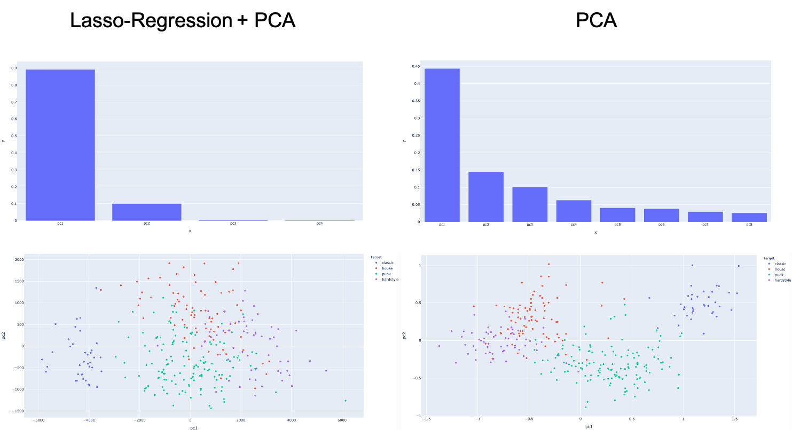

# Overview

<!-- TOC -->

- [Overview](#overview)
- [Scope](#scope)
- [Feature Extraction](#feature-extraction)
- [Analyze different songs](#analyze-different-songs)
    - [Resulting DataFrame of the feature extraction](#resulting-dataframe-of-the-feature-extraction)
    - [Preprocessing for Machine Learning approaches](#preprocessing-for-machine-learning-approaches)

<!-- /TOC -->

# Scope

The overall task of this project was to determine the musical genre of a song by means of self-created audio features. In order not to go beyond the scope of this project I concentrated on 4 genres and created a data set of 311 songs.

1. 4 genres: punk, classic, hardstyle & house
2. Librosa library to calculate 27 characteristics of each song
3. Train machine learning models for classification (clustering, Support Vector Machines & RandomForest)
4. Evaluation of the results
5. Comparison to prediction using the features provided by the Spotify API.

To accomplish this task, 27 properties per song were extracted from your record of 311 songs. These were then prepared for a corresponding prediction model using various machine learning techniques such as PCA.

>This project includes both signal processing methods and various machine learning techniques such as clustering & support vector machines. Due to the size of the project, not every method used can be explained in detail. I am also in no way a specialist in signal processing methods, so the results obtained here should only be considered as a first suggestion and certainly provide room for optimization!  
Furthermore, various publications form the basis of this work and offer further information on the respective topics.
* https://myhometheater.homestead.com/RMS.html
* http://mir.ilsp.gr/harmonic_percussive_separation.html
* https://medium.com/heuristics/audio-signal-feature-extraction-and-clustering-935319d2225
* https://towardsdatascience.com/extract-features-of-music-75a3f9bc265d
* https://towardsdatascience.com/feature-selection-with-pandas-e3690ad8504b 
* https://towardsdatascience.com/pca-using-python-scikit-learn-e653f8989e60

# Feature Extraction

# Analyze different songs

For analyzing these songs and therefore be able to create corresponding features which describe the given sound we will use different *feature extraction* tools which are build into `librosa`. Here is an overview over what we will use and what they describe:

* **Harmonic / Percussive Split of the original audio data:**  
The aim of the Harmonic/Percussive separation is to decompose the original music signal to the harmonic (i.e. pitched instruments) and the percussive (non pitched instruments, percussion) parts of the signal. Such methods can be applied to audio mixing software, or can be adopted as preprocessing on other Music Information Retrieval Methods such as rhythm analysis or chord/tonality recognition.
The method is based on the assumption that harmonic components exhibit horizontal lines on the spectrogram while the percussive sounds are evident as vertical lines. By adopting Non-Linear image filters applied to the spectrogram in order to filter out these component, the proposed method is simple, intuitive and does not make any prior assumption of the genre,style or instrumentation of the target music.  
  

Source: http://mir.ilsp.gr/harmonic_percussive_separation.html

```python
# split song into harmonic and percussive parts
y_harmonic, y_percussive = lb.effects.hpss(song)
print('Harmonic / Percussive split successful.')

# Compute power spectrogram.
stft_harmonic = lb.core.stft(y_harmonic, n_fft=n_fft, hop_length=hop_length)
# Compute power spectrogram.
stft_percussive = lb.core.stft(y_percussive, n_fft=n_fft, hop_length=hop_length)
```

* **RMS values and related features:**  
The RMS (Root-Mean-Square) value is the effective value of the total waveform.  It is really the area under the curve. In audio it is the continuous or music power that the amplifier can deliver.   
Using RMS values allows for calculations to be completed more easily.  
Bottom Line: For audio applications, our ears are RMS instruments, not peak reading.  So using RMS values makes sense, and is normally how amplifiers are rated.

```python
rmsH = np.sqrt(np.mean(np.abs(lb.feature.rms(S=stft_harmonic)) ** 2, axis=0, keepdims=True))
rmsH_a = np.mean(rmsH)
rmsH_std = np.std(rmsH)
rmsH_skew = skew(np.mean(rmsH, axis=0))
rmsH_kurtosis = kurtosis(np.mean(rmsH, axis=0), fisher=True, bias=True)

rmsP = np.sqrt(np.mean(np.abs(lb.feature.rms(S=stft_percussive)) ** 2, axis=0, keepdims=True))
rmsP_a = np.mean(rmsP)
rmsP_std = np.std(rmsP)
rmsP_skew = skew(np.mean(rmsP, axis=0))
rmsP_kurtosis = kurtosis(np.mean(rmsP, axis=0), fisher=True, bias=True)
```

*   **Spectral Centroid:**
It indicates where the ”centre of mass” for a sound is located and is calculated as the weighted mean of the frequencies present in the sound. If the frequencies in music are same throughout then spectral centroid would be around a centre and if there are high frequencies at the end of sound then the centroid would be towards its end.

```python
centroid = lb.feature.spectral_centroid(song, sr, n_fft=n_fft, hop_length=hop_length)  
centroid_a = np.mean(centroid)
centroid_std = np.std(centroid)
```

*  **Chroma Frequencies:**
Chroma features are an interesting and powerful representation for music audio in which the entire spectrum is projected onto 12 bins representing the 12 distinct semitones (or chroma) of the musical octave. It is a representation of how humans relate colors to notes. In other words we think of same notes but from two different octaves to be of the same color. Thus we have 12 possible values at each window. A, A#, B, C, C#, D, D#, E, F, F#, G and G#. Of course they are not mutually exclusive hence for a given time fame one can have more than one note. But to keep things simple we will only select the most prominent note for a particular window. Let us visualize the chroma vector using a chromagram.

```python
def getNoteFrequency( chromagram ):
    
    # Total number of time frames in the current sample
    numberOfWindows = chromagram.shape[1]
    
    # Taking the note with the highest amplitude
    freqVal = chromagram.argmax( axis = 0 )
    
    # Converting the freqVal vs time to freq count
    histogram, bin = np.histogram( freqVal, bins = 12 ) 
    
    # Normalizing the distribution by the number of time frames
    normalized_hist = histogram.reshape( 1, 12 ).astype( float ) / numberOfWindows
    
    return normalized_hist

chroma = lb.feature.chroma_stft(song, sr=sr)
noteFrequency = getNoteFrequency(chroma)
```

* **Spectral bandwidth:**  
Computes the order- p  spectral bandwidth:  
$( \sum \limits_{n=0}^{\infty} S ( k ) * (  f ( k ) - f_{c} )^p)^{\frac{1}{p}} )$  

$3 + 3 = 6$

where  S(k)  is the spectral magnitude at frequency bin  k ,  f(k)  is the frequency at bin  k , and  fc  is the spectral centroid. When  p=2 , this is like a weighted standard deviation.

```python
bw = lb.feature.spectral_bandwidth(song, sr, n_fft=n_fft, hop_length=hop_length)  
bw_a = np.mean(bw)
bw_std = np.std(bw)
```

* **Spectral contrast:**  
Spectral contrast considers the spectral peak, the spectral valley, and their difference in each frequency subband.  
Automatic music type classification is very helpful for the management of digital music database. Octavebased Spectral Contrast feature is proposed to represent the spectral characteristics of a music clip. It represented the relative
spectral distribution instead of average spectral envelope. Experiments showed that Octave-based Spectral Contrast feature
performed well in music type classification. Another comparison experiment demonstrated that Octave-based Spectral Contrast
feature has a better discrimination among different music types than Mel-Frequency Cepstral Coefficients (MFCC), which is
often used in previous music type classification system.  
Each frame of a spectrogram S is divided into sub-bands. For each sub-band, the energy contrast is estimated by comparing the mean energy in the top quantile (peak energy) to that of the bottom quantile (valley energy). High contrast values generally correspond to clear, narrow-band signals, while low contrast values correspond to broad-band noise.

```python
contrast = lb.feature.spectral_contrast(song, sr, n_fft=n_fft, hop_length=hop_length)
contrast_a = np.mean(contrast)
contrast_std = np.std(contrast)
```

* **Polynomial features:**  
Get coefficients of fitting an nth-order polynomial to the columns of a spectrogram.

```python
polyfeat = lb.feature.poly_features(y_harmonic, sr, n_fft=n_fft, hop_length=hop_length)
polyfeat_a = np.mean(polyfeat[0])
polyfeat_std = np.std(polyfeat[0])
```

* **Tonal centroid features (tonnetz):**  
In musical tuning and harmony, the Tonnetz (German: tone-network) is a conceptual lattice diagram representing tonal space first described by Leonhard Euler in 1739. Various visual representations of the Tonnetz can be used to show traditional harmonic relationships in European classical music.

```python
tonnetz = lb.feature.tonnetz(lb.effects.harmonic(y_harmonic), sr)
tonnetz_a = np.mean(tonnetz)
tonnetz_std = np.std(tonnetz)
```

*   **Zero crossing rate:**  
The zero crossing rate is the rate of sign-changes along a signal, i.e., the rate at which the signal changes from positive to negative or back. This feature has been used heavily in both speech recognition and music information retrieval. It usually has higher values for highly percussive sounds like those in metal and rock.

```python
zcr = lb.feature.zero_crossing_rate(song, sr, hop_length=hop_length)
zcr_a = np.mean(zcr)
zcr_std = np.std(zcr)
```

*   **Spectral Rolloff:**
It is a measure of the shape of the signal. It represents the frequency below which a specified percentage of the total spectral energy, e.g. 85%, lies.

```python
roll_off = lb.feature.spectral_rolloff(song, sr, hop_length=hop_length)
roll_off_a = np.mean(roll_off)
roll_off_std = np.std(roll_off)
```

* **Onset srength:**  
Compute a spectral flux onset strength envelope. Onset strength at time t is determined by:  
`mean_f max(0, S[f, t] - ref[f, t - lag])`, where ref is S after local max filtering along the frequency axis. By default, if a time series y is provided, S will be the log-power Mel spectrogram.

```python
onset_env = lb.onset.onset_strength(y_percussive, sr=sr)
onset_a = np.mean(onset_env)
onset_std = np.std(onset_env)
```

* **Beat information:**  
Dynamic programming beat tracker. Beats are detected in three stages, following the method of:  
    * Measure onset strength
    * Estimate tempo from onset correlation
    * Pick peaks in onset strength approximately consistent with estimated tempo

```python
bpm, beats = lb.beat.beat_track(y=y_percussive, sr=sr, onset_envelope=onset_env, units='time')
beats_a = np.mean(beats)
beats_std = np.std(beats)
```

The given songs belong to the following genre:

* **0:** Classic
* **1:** Hardstyle
* **2:** House
* **3:** Punk

## Resulting DataFrame of the feature extraction

As a result of the extracting step we get a 28 x 311 DataFrame which contains 27 features for each of the songs. Important to mention here is that **not every genre as the same amount of songs within tha dataset!** We have the following distribution:

* **0:** Classic:   37 (~ 13%)
* **1:** Hardstyle: 60 (~ 19%)
* **2:** House:     80 (~ 25%)
* **3:** Punk:      134 (~ 43%)

## Preprocessing for Machine Learning approaches

As already described in detail, the dimension of the data set has been reduced to achieve a better final result. With only 311 data points and 27 features the probability of overfitting is very high.

We tested a Lasso Regression + PCA as well as a pure PCA without a previous elimination of features by the Lasso Regression. 

1. Lasso-regression with subsequent PCA of the most important features.
2. Pure PCA on 4 main components.

  

sdjsbndsjds
